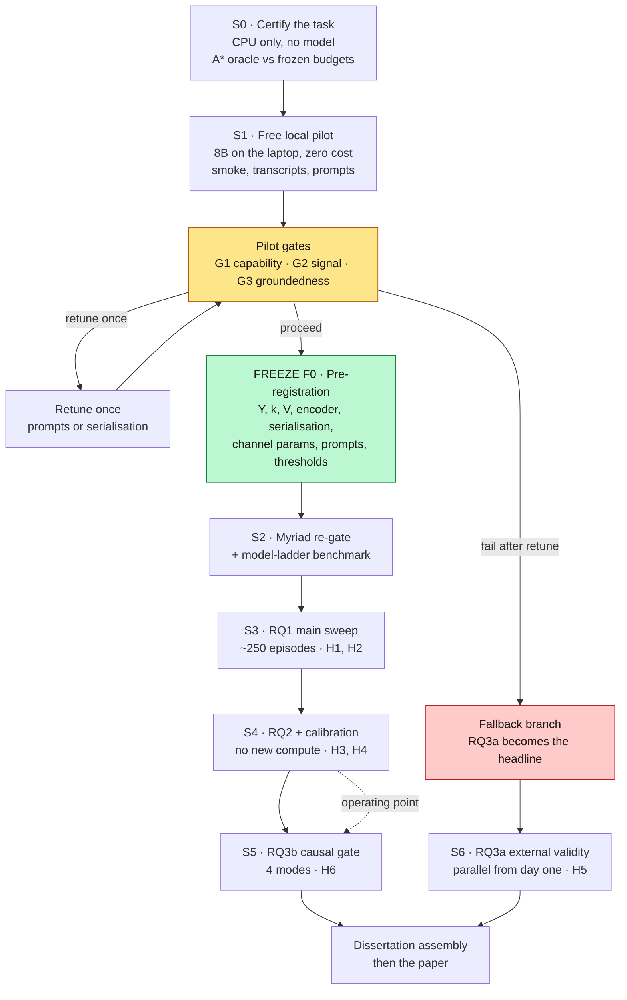
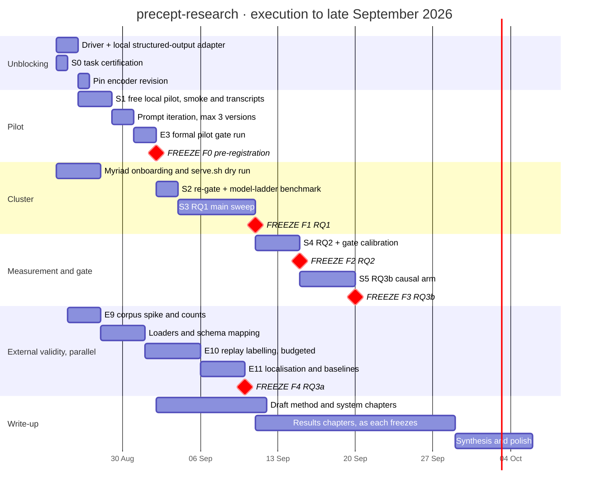
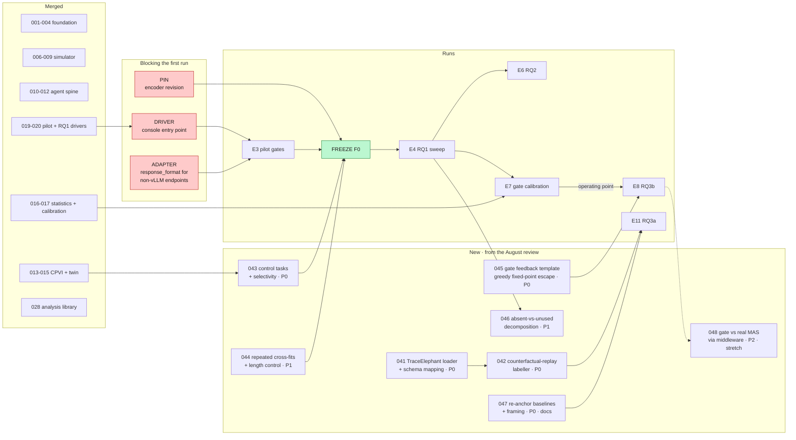
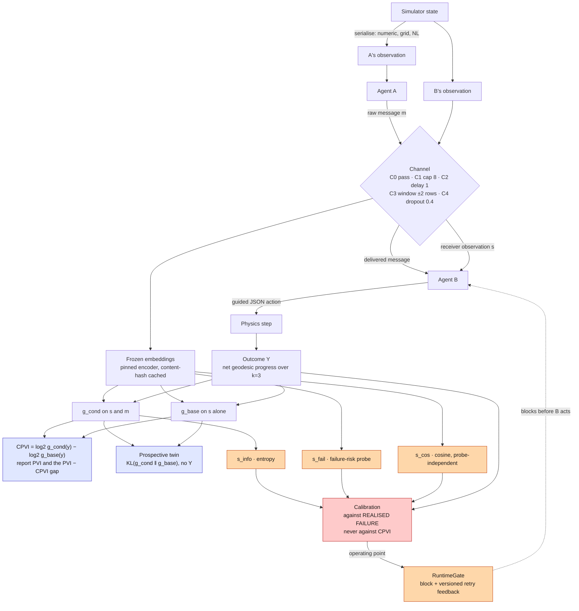

# Visual roadmap and change record

> Companion to `RESEARCH_ROADMAP.md`, which carries the prose. This file is the picture and the
> running record of what changed and why. Diagrams are Mermaid and render on GitHub.
>
> **Last revised:** 23 August 2026.

---

## 1. What changed

### 1.1 Since 25 July 2026

Six changes, ordered by how much each moves the dissertation. Every one is a decision already taken,
not an option still open; the evidence for each sits in `docs/experiment_design_log.md` and the
resulting text in `docs/methodology.md` §10.5.

| # | Change | From | To | Why it matters |
|---|---|---|---|---|
| 1 | **Compute resolved** | One open decision blocking the whole plan | UCL Myriad allocation **approved 23 Aug 2026**: 1 GPU ≥40 GB, single node, 8 h wall, 8 cores, 32 GB RAM, ~45 GB weights on scratch | The roadmap's only material unknown is closed. The plan is now execution-bound, not decision-bound |
| 2 | **RQ3a substrate migrated** | Who&When primary | **TraceElephant primary**; Who&When retained as a flagged transfer-only anchor; MAST secondary | Who&When records agent *outputs* only, so it cannot supply the receiver's input context the conditional construct requires, and it is single-class so the refit arm is undefined on it |
| 3 | **Y on real logs defined** | Localise the annotated decisive step | **Counterfactual replay** defines *Y* interventionally; the annotation is named as considered-and-rejected | Using the annotation as *Y* trains the probe on the label the claim is evaluated against. Replay puts the external-validity and causal claims on one epistemology |
| 4 | **Probe methodology hardened** | Shuffled-message audit only | Adds **control-task selectivity**, **repeated cross-fits**, and **pre-registered length controls** | Three different objections need three different nulls. Selectivity is the one an NLP examiner asks for by name |
| 5 | **SocialJax cut on evidence** | Retained as a learned-message contrast | **Cut**, with the reason moved from the schedule to the limitations | The suite ships no communication channel and no communication algorithm, so there is no message to score. Replaced by the absent-versus-unused decomposition, which uses data the main sweep already produces |
| 6 | **Baselines re-anchored** | H5 positioned against 53.5% agent / 14.2% step | Positioned on the **prospective-versus-retrospective and cost axes**; 2025 figures kept as a dated floor | Those numbers have been beaten. Writing to them was the most likely hostile viva question |

### 1.2 Found during this cross-reference, and not in any prior document

Two 2026 papers sit close to the contribution and were absent from the 25 July review. Both are now in
`docs/methodology.md`; the first changes how the contribution must be framed.

- **AgentForesight** (arXiv:2605.08715) reframes failure attribution as *online auditing*: an auditor
  sees only the prefix of an unfolding trajectory and must continue or alarm at the earliest decisive
  error. It therefore occupies the pre-outcome setting, and a contribution claim resting on
  prospectivity alone would now be contested. Three differences survive and are argued in §7 of the
  methodology: it is a **detector, not a measure** — a 7B RL-trained model emitting a verdict, against a
  log-loss difference between two logistic probes; it audits a **trajectory prefix**, not a single
  boundary; and it **raises an alarm without blocking or rewriting** the message, and is not validated
  against a matched-firing-rate control. The causal arm here does exactly that.
- **Causal Agent Replay** (arXiv:2606.08275) formalises step-level counterfactual intervention as a
  structural causal model with a replay-based estimator. It strengthens the citation base for the
  replay-defined *Y* rather than threatening it; what remains novel is using replay to define the
  *target of an information-theoretic boundary measure*, which it does not do.

### 1.3 The state nobody should misread

The engineering is substantially built and the science has not started. Nineteen of thirty original
tickets are merged, the spine from arena to gate calibration is tested, and **zero episodes have been
recorded**. Everything to date has run against stub models. The binding constraint has never been
Myriad access; it is that the pilot has never run, and that there is no command-line driver, so even
with a served model today about thirty lines stand between the repository and its first result.

---

## 2. Programme map

The two structural facts in this picture. **S6 hangs off the measurement stack, not off the gate and
not off the sweep**, which is why it runs in parallel and why it can absorb a pilot failure. And
**F0 sits between the pilot and every main run** — choosing *Y* or *V* after seeing main-run results
is the forbidden move, so the freeze is a gate rather than a milestone.

---

## 3. Calendar

Dates are indicative and the ordering is the load-bearing part. The one hard sequencing constraint is
that **F0 precedes S3**; everything else can slip without invalidating a result.

---

## 4. Critical path and the new tickets

Read this for two things. The three red boxes are the entire distance between "built" and "running",
and none of them is large. And **DSE-043 and DSE-044 must land before F0**, because both change what
gets frozen — adding a selectivity check after the freeze would mean either re-freezing or reporting a
number the freeze does not cover.

---

## 5. Measurement architecture

Three invariants this diagram exists to make visible. **The channel touches the message and B's
observation, and nothing else** — no path runs from the channel into physics or the action. **CPVI
consumes Y and the twin does not**, which is why one is an offline audit quantity and the other can
inform a runtime decision. And **calibration reads realised failure, never CPVI**: the red box is the
circularity guard, and `s_cos` exists specifically so that at least one runtime statistic depends on no
fitted probe at all.
